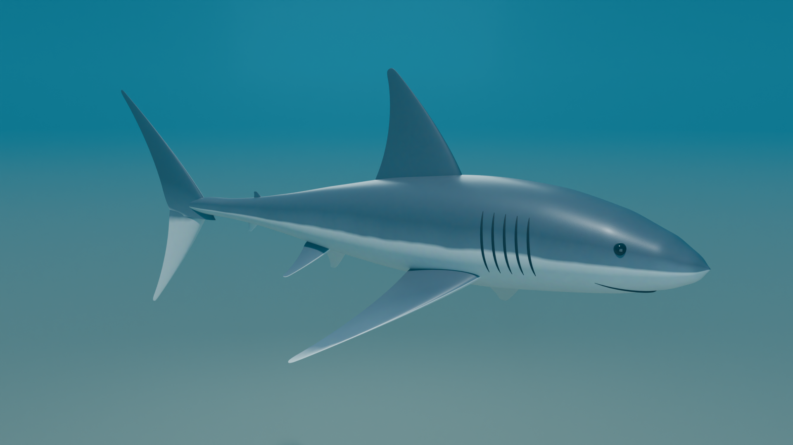

# Акула в Blender

Процедурная 3D-модель большой белой акулы, построенная скриптом на Python для Blender.



- `shark.py` — скрипт, который строит модель (тело, плавники, глаза, жабры, рот), материалы, подводную сцену и рендерит её в Cycles.
- `shark.blend` — готовый файл сцены Blender.
- `shark_render.png` — финальный рендер 1920×1080.

Запуск:

```bash
blender -b -P shark.py -- --samples 160 --res 1920x1080
# или с модулем bpy (pip install bpy):
python3 shark.py --samples 160 --res 1920x1080
```
